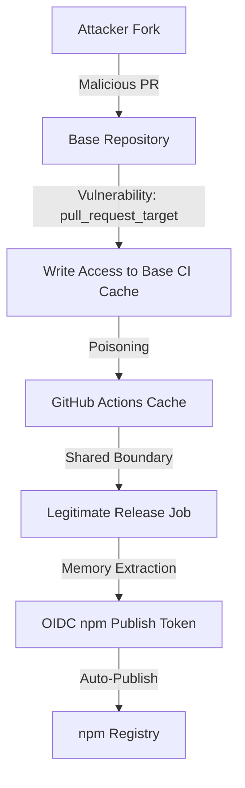

# The GitHub Issue: CI/CD Supply Chain Attack

In May 2026, the JavaScript ecosystem experienced one of the most sophisticated supply chain attacks ever documented. A malicious worm named **Mini Shai-Hulud** compromised **84 npm package artifacts across 42 `@tanstack/*` packages**, affecting libraries with over **12 million weekly downloads**.

This incident was not a simple developer credential leak. It was a chained, automated attack that exploited vulnerabilities in trusted CI/CD infrastructure, dynamically publishing malicious updates to the npm registry.

---

## 1. The Three-Stage Attack Chain

The attacker did not target maintainers with phishing or steal long-lived API keys from their personal computers. Instead, the attack exploited the trust boundaries within **GitHub Actions** and the package release pipeline.



The compromise operated through a three-stage exploit chain:

### Stage 1: Pwn Request
The attacker submitted a pull request from a malicious fork. The target repository used a `pull_request_target` workflow configuration. Unlike the standard `pull_request` trigger, `pull_request_target` executes in the context of the base branch, granting the workflow write access to the repository's repository-level resources, including the CI cache.

### Stage 2: Cache Poisoning
The attacker used this execution capability to write malicious data to the repository's GitHub Actions cache. Because GitHub Actions cache is shared across the fork-base boundary, the poisoned cache was made available to subsequent, legitimate workflow runs.

### Stage 3: OIDC Token Theft
When a core maintainer initiated a legitimate release workflow, the runner restored the poisoned cache. The malicious code executed inside the trusted CI runner environment, extracted the ephemeral OIDC token directly from the runner's runtime memory, and used it to publish malicious packages under the `latest` tag on the npm registry.

---

## 2. Malware Capabilities and Persistence

The compromised packages contained heavily obfuscated payloads (totaling 2.3 MB in `router_init.js`). Once executed on a user's machine or a build server, the malware performed several sophisticated tasks:

- **Credential Harvesting**: It searched environment variables and files for active credentials from GitHub Actions, AWS (IMDSv2, Secrets Manager, SSM), HashiCorp Vault, and Kubernetes.
- **Dynamic Propagation**: Using harvested OIDC and npm tokens, the malware attempted to locate other repositories on the system and automatically publish malicious updates to their respective registries.
- **Deep IDE Persistence**: The worm was designed to survive standard cleanups. It wrote copies of itself into hidden developer directories:
  - `.claude/router_runtime.js`
  - `.vscode/tasks.json` (registering automated tasks to run the malware on workspace events)
  - `.claude/settings.json` (binding malicious hooks to tool events)
- **Covert C2 Exfiltration**: Exfiltrated credentials were routed through Session's decentralized peer-to-peer (P2P) network (`filev2.getsession.org`), rendering command-and-control (C2) traffic indistinguishable from legitimate, encrypted messaging traffic.

---

## 3. Key Realizations for Modern Defenders

The TanStack breach revealed major blind spots in common supply chain assumptions:

1. **Sigstore Provenance Badges Are Not a Guarantee**: Valid package provenance and Sigstore signatures only prove that the package was built on a valid GitHub Actions runner. Because the malware executed *inside* the legitimate runner, it generated completely valid, signed provenance badges for the compromised artifacts.
2. **`pull_request_target` is Highly Dangerous**: Using `pull_request_target` in combination with checking out code from a fork creates a severe elevation of privilege risk. GitHub has warned against this pattern for over three years, yet it remains common in major open-source repositories.
3. **The Actions Cache is a Trust Boundary**: The GitHub Actions cache has historically lacked strong isolation boundaries between fork-based pull requests and base branches. Treat the cache as untrusted input.
4. **Worms Survive package uninstallation**: Traditional package remediation (running `npm uninstall`) is completely ineffective if the malware has already established persistence in your developer environment dotfiles.

---

## 4. Hardening and Remediation Playbook

### Step 1: Manual Persistence Auditing
If you installed or updated any `@tanstack/*` package between May 10 and May 15, 2026, you must audit your local environment for persistence hooks.

Run the following commands in your project roots and home directories:

```bash
# Check for active router_init.js payloads
shasum -a 256 **/router_init.js

# Expected malicious SHA-256 hash:
# ab4fcadaec49c03278063dd269ea5eef82d24f2124a8e15d7b90f2fa8601266c

# Look for persistence runtime files
ls -la .claude/router_runtime.js .claude/setup.mjs .vscode/setup.mjs

# Review local tool logs for unauthorized commits
git log --all --author="claude@users.noreply.github.com"
```

If any files are found, delete them immediately:
```bash
rm -rf .claude/router_runtime.js .claude/setup.mjs
rm -rf .vscode/setup.mjs
```
Also, manually review `.vscode/tasks.json` and `.claude/settings.json` to ensure no malicious task configurations or hooks are active.

### Step 2: Secret Rotation
If compromise is suspected, immediately rotate all credentials exposed to the environment, in this order:
1. npm publishing tokens.
2. GitHub Personal Access Tokens (PATs) and OIDC integration permissions.
3. AWS access keys and IAM instance roles.
4. HashiCorp Vault access credentials.
5. Kubernetes service account tokens.

### Step 3: Hardening CI/CD Workflows
Apply the following defensive practices to all GitHub Actions workflows:

```yaml
# In your workflow configuration, force secure default permissions:
permissions:
  contents: read
  id-token: none  # Block OIDC tokens unless explicitly required for publishing jobs
```

- **Eliminate `pull_request_target`**: Replace `pull_request_target` with standard `pull_request`. If you must run tests on fork contributions that require secrets, use a `workflow_run` pattern where the untrusted PR runs in a zero-privilege sandbox, saves artifacts, and a separate, restricted workflow parses the results safely.
- **Pin Actions to Commit SHAs**: Do not rely on tags (such as `actions/checkout@v4`). Tags can be modified or spoofed. Pin your imports to complete, cryptographic commit hashes:
  ```yaml
  # Vulnerable:
  - uses: actions/checkout@v4
  
  # Secure:
  - uses: actions/checkout@b4ffde65f46336ab88eb53be808477a3936bae11
  ```
- **Harden Cache Restores**: Avoid using generic `actions/cache` write routines in pipelines that handle release credentials. Use `actions/cache/restore` to explicitly restore cache files without giving the runner permission to update or write back to the base cache.
- **Integrate Static Workflow Scanners**: Incorporate static analysis tools (such as **zizmor**) into your pull request pipelines as a required status check. Zizmor automatically flags insecure workflow configurations (like `pull_request_target` combined with checkout, or over-privileged OIDC configurations) before code is merged.
- **Enforce Non-SMS Multi-Factor Authentication**: Upgrade your npm, GitHub, and cloud accounts to use hardware keys (such as FIDO2 WebAuthn) or secure authenticator applications. SMS-based 2FA is no longer sufficient to secure publishing pipelines.
