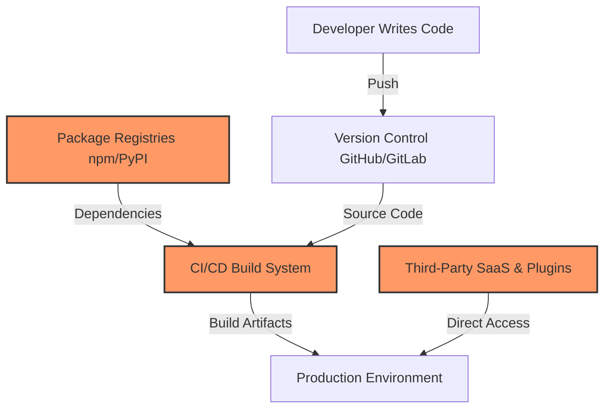

# Advanced Supply Chain Security

Traditional cybersecurity focuses heavily on perimeter defense, network firewalls, and direct endpoint security. However, as organizations harden their outward-facing infrastructure, attackers have shifted their focus to a highly effective backdoor: the **Software Supply Chain**.

A supply chain attack does not compromise the target directly. Instead, it injects malicious code or behavior into a trusted third-party component, package, developer tool, or cloud integration that the target already uses. Because the target trusts the source, the malicious update is automatically pulled past the perimeter defenses.



---

## 1. Upstream Source Vector: Trust in Maintainers

The first entry point is at the very beginning of the supply chain: the source code repositories of open-source projects and libraries.

### Maintainer Social Engineering
Attackers target open-source maintainers through sophisticated, multi-year social engineering campaigns.
- **The Attack Pattern**: An attacker uses multiple fake accounts (sockpuppets) to submit helpful pull requests to an open-source library over months or years. Once they gain the main author's trust, they volunteer to help maintain the project. After obtaining direct commit access, they silently insert a highly complex backdoor.
- **Real-World Case Study (XZ Utils, 2024)**: A pseudonymous actor named "Jia Tan" spent over two years contributing to the `xz` compression library. Eventually, they gained maintainer status and injected a highly stealthy backdoor into `liblzma`, designed to allow remote code execution via SSH. The backdoor was caught by a developer noticing microscopic performance slowdowns during database connections.

### Dependency and Registry Exploits
Package registries (like npm, PyPI, and RubyGems) handle billions of automated downloads daily. Attackers exploit how package managers resolve names and run installation scripts:

- **Typosquatting**: Attackers register packages with names extremely similar to popular libraries (for example, `reqeusts` instead of `requests`). If a developer makes a typing error in their configuration, they pull down the malicious package.
- **Dependency Confusion**: Organizations often use internal private packages (e.g., `@ourcompany/auth`). If the internal package registry is misconfigured or fails, the package manager may search public registries instead. Attackers register the identical package name (`@ourcompany/auth`) on public registries with a high version number (like `99.9.9`), forcing the build system to fetch the attacker's public package rather than the internal private one.
- **Malicious Install Scripts**: The `package.json` file in JavaScript or setup scripts in Python allow developers to run commands during package installation (using hook scripts like `preinstall`). Attackers publish packages that use these hooks to run scripts that search for and steal environment variables, SSH keys, and cloud tokens immediately upon running `npm install` or `pip install`.

---

## 2. Build-Time and CI/CD Vector: Compromising the Pipeline

Even if your source code is secure, the environment that compiles, packages, and deploys your code can be compromised.

### The CI/CD Pipeline as an Attack Engine
Continuous Integration and Continuous Deployment (CI/CD) runners are high-value targets because they have direct read access to your private repositories, write access to package registries, and admin keys to cloud environments.

- **SUNBURST (SolarWinds Orion, 2020)**: This remains one of the most sophisticated supply chain attacks in history. Attackers compromised SolarWinds' internal build environment. They deployed a malicious background process that watched for the compiler to run. The moment the compiler started assembling the legitimate Orion update, the malware quickly swapped a source file in memory with a trojanized version. The resulting, officially signed software update contained a backdoor distributed to 18,000 customers.
- **OIDC Token and Actions Cache Poisoning**: In modern GitHub Actions pipelines, workflows use OpenID Connect (OIDC) to request temporary, short-lived tokens from cloud providers (like AWS or npm). Attackers submit pull requests from forks that exploit workflow configurations (like `pull_request_target`) to overwrite shared runner caches. The next time a legitimate build runs, the runner loads the poisoned cache, executes malicious code, extracts the OIDC publish tokens from memory, and publishes unauthorized updates.

---

## 3. Developer Environment Vector: Compromising the Workstation

A developer's laptop is the ultimate gateway to the supply chain. Because developers have write access to critical codebases, cloud consoles, and publishing portals, their local setup is heavily targeted.

### Malicious IDE Extensions
Modern integrated development environments (IDEs) like VS Code rely on third-party extension marketplaces to provide autocompletion, linters, and themes.
- **Extension Hijacking**: Attackers buy outdated, popular extensions from developers or buy domain names associated with abandoned extensions. They push updates containing malicious payloads that run inside the developer's local editor, extracting active session tokens, browser history, and SSH keys.

### Workspace Hijacking
Attackers use repository configurations to execute code the moment a developer cloned a repository and opens it in their editor:
- **VS Code Tasks (`tasks.json`)**: Opening a workspace in VS Code allows the project to run local tasks. Attackers commit a malicious task to a public repository that triggers on workspace open events (like `folderOpen`), running malicious scripts in the developer's local terminal without their active consent.

---

## 4. Architectural Defenses and Mitigation

Securing the supply chain requires a Zero Trust approach to dependencies and third-party tools. Treat every imported package and action as untrusted until validated.

```
       Vulnerability                     Defense Strategy
┌───────────────────────────┐      ┌───────────────────────────┐
│ Typosquatting / Confusion │ ───> │ Lockfiles + Private Scopes│
├───────────────────────────┤      ├───────────────────────────┤
│ Outdated/Vulnerable Deps  │ ───> │ SCA Scanning + SBOMs      │
├───────────────────────────┤      ├───────────────────────────┤
│ Compromised GitHub Actions│ ───> │ Pin to Commit SHAs        │
├───────────────────────────┤      ├───────────────────────────┤
│ Secret Exfiltration in CI │ ───> │ Restricted OIDC + Scanners│
└───────────────────────────┘      └───────────────────────────┘
```

### Dependency Hardening
- **Strict Package Pinning**: Use lockfiles (`package-lock.json`, `pnpm-lock.yaml`, `poetry.lock`) to enforce reproducible builds. Never use open-ended versions (like `*` or `^latest`) in production.
- **Scoping and Internal Registries**: Use scoped package namespaces (e.g., `@company/`) and configure your package manager to fetch scoped libraries exclusively from your private registry, eliminating dependency confusion.
- **Disable Install Scripts**: Configure package managers to run without executing install scripts (e.g., running `npm install --ignore-scripts` or setting `ignore-scripts=true` in `.npmrc`).

### CI/CD Security Architecture
- **Pin Actions to Commit SHAs**: Do not use mutable tags (like `uses: actions/checkout@v4`). Tags can be updated to point to malicious code. Pin imports to complete cryptographic commit hashes (like `uses: actions/checkout@b4ffde65f46336ab88eb53be808477a3936bae11`).
- **Least-Privilege Workflows**: Force strict default permissions in your workflow files. Block write access and token generation unless explicitly required by a specific publish job:
  ```yaml
  permissions:
    contents: read
    id-token: none
  ```
- **Static Workflow Analysis**: Run security scanners (like **zizmor**) inside your CI pipelines. These tools analyze your workflow configurations, immediately warning you of structural issues such as over-privileged tokens or dangerous checkout configurations.

### Transparency and Attestation
- **Generate SBOMs (Software Bill of Materials)**: An SBOM is a machine-readable inventory listing every component, dependency, and license in your software. Tools like `syft` scan your codebase and build artifacts to produce an exhaustive SBOM, making it easy to track vulnerable components.
- **Build Attestations**: Generate cryptographic build attestations (using technologies like Sigstore and GitHub Artifact Attestations). Attestations prove that a specific container or package was built within a specific, secure GitHub Action workflow, ensuring no tampered binary can be deployed.

---

## Key Takeaways

1. **Your dependencies are your code**: You are fully responsible for the security of every library, utility, and build tool you import.
2. **Trust nothing implicitly**: Just because a package has a signature or comes from a legitimate runner does not prove it is safe; the signer could be compromised.
3. **Isolate CI/CD boundaries**: Apply Zero Trust principles to build environments. Block secrets from untrusted pull request workflows and strictly limit default permissions.
4. **Harden your developer environment**: Treat your local machine as a production asset. Keep tools updated, audit extensions, and review workspace configurations before opening untrusted projects.
