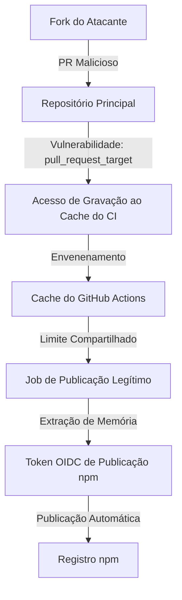

# O Caso GitHub: Ataque de Cadeia de Suprimentos no CI/CD

Em maio de 2026, o ecossistema JavaScript passou por um dos ataques de cadeia de suprimentos (supply chain attacks) mais sofisticados já registrados. Um worm malicioso chamado **Mini Shai-Hulud** comprometeu **84 artefatos de pacotes npm em 42 pacotes `@tanstack/*`**, afetando bibliotecas com mais de **12 milhões de downloads semanais**.

Este incidente não foi um vazamento simples de credenciais de desenvolvedores. Trata-se de um ataque automatizado e encadeado que explorou vulnerabilidades na infraestrutura de CI/CD confiável, publicando atualizações maliciosas diretamente no registro npm.

---

## 1. A Cadeia de Ataque em Três Etapas

O atacante não usou engenharia social contra mantenedores nem roubou chaves de API de longa duração de seus computadores pessoais. Em vez disso, o ataque explorou as permissões internas e limites de confiança dentro do **GitHub Actions** e do pipeline de publicação de pacotes.



O comprometimento funcionou por meio de uma cadeia de exploração em três etapas:

### Etapa 1: Pwn Request (Requisição Invadida)
O atacante enviou um pull request a partir de um fork malicioso. O repositório alvo usava uma configuração de fluxo de trabalho `pull_request_target`. Ao contrário do gatilho padrão `pull_request`, o `pull_request_target` é executado no contexto do branch principal, concedendo ao fluxo de trabalho acesso de gravação aos recursos do repositório, incluindo o cache do CI.

### Etapa 2: Envenenamento de Cache (Cache Poisoning)
O atacante usou essa permissão de execução para gravar dados maliciosos no cache do GitHub Actions do repositório principal. Como o cache do GitHub Actions é compartilhado entre o branch do fork e o principal, o cache envenenado ficou disponível para execuções de fluxos de trabalho legítimos subsequentes.

### Etapa 3: Roubo de Token OIDC
Quando um mantenedor iniciou um fluxo de trabalho de publicação legítimo, o executor do CI restaurou o cache envenenado. O código malicioso foi executado no ambiente de execução do CI confiável, extraiu o token OIDC temporário diretamente da memória de execução do runner e o utilizou para publicar pacotes maliciosos sob a tag `latest` no registro npm.

---

## 2. Recursos do Malware e Persistência

Os pacotes comprometidos continham payloads altamente ofuscados (com 2.3 MB no arquivo `router_init.js`). Uma vez executado na máquina de um usuário ou servidor de build, o malware realizava tarefas complexas:

- **Coleta de Credenciais**: Buscou variáveis de ambiente e arquivos locais por credenciais ativas do GitHub Actions, AWS (IMDSv2, Secrets Manager, SSM), HashiCorp Vault e Kubernetes.
- **Autopropagação Dinâmica**: Utilizando os tokens OIDC e npm roubados, o malware tentava localizar outros repositórios no sistema e publicar atualizações maliciosas automaticamente em seus respectivos registros.
- **Persistência Profunda na IDE**: O worm foi projetado para sobreviver a limpezas padrão. Ele gravou cópias de si mesmo em pastas ocultas do desenvolvedor:
  - `.claude/router_runtime.js`
  - `.vscode/tasks.json` (registrando tarefas automatizadas para executar o malware em eventos da workspace)
  - `.claude/settings.json` (vinculando ganchos maliciosos a eventos de ferramentas)
- **Exfiltração Oculta por C2**: As credenciais coletadas foram enviadas por meio da rede peer-to-peer (P2P) descentralizada do Session (`filev2.getsession.org`), tornando o tráfego de comando e controle (C2) indistinguível de mensagens criptografadas legítimas.

---

## 3. Principais Conclusões para Defensores Modernos

O vazamento do TanStack revelou pontos cegos graves nas premissas comuns de segurança de código:

1. **Selos de Proveniência do Sigstore Não Garantem Segurança**: A proveniência do pacote e as assinaturas do Sigstore apenas provam que o pacote foi construído em um executor de fluxo legítimo do GitHub. Como o malware foi executado *dentro* do runner legítimo, ele gerou selos de proveniência perfeitamente válidos e assinados para os artefatos maliciosos.
2. **`pull_request_target` é Altamente Perigoso**: Usar `pull_request_target` em conjunto com a verificação de código (checkout) de um fork cria um risco severo de elevação de privilégio. O GitHub alerta contra esse padrão há mais de três anos, mas ele continua sendo comum em grandes repositórios de código aberto.
3. **O Cache do Actions é um Canal de Confiança Aberto**: O cache do GitHub Actions historicamente carece de isolamento rígido entre pull requests de forks e branches principais. Trate o cache como dados de entrada não confiáveis.
4. **Worms Sobrevivem à Remoção de Pacotes**: A remediação de pacotes tradicional (como rodar `npm uninstall`) é ineficaz se o malware já tiver estabelecido persistência nos arquivos de configuração locais (`.claude` ou `.vscode`).

---

## 4. Playbook de Endurecimento (Hardening) e Remediação

### Passo 1: Auditoria Manual de Persistência
Se você instalou ou atualizou qualquer pacote `@tanstack/*` entre 10 e 15 de maio de 2026, você deve auditar seu ambiente local em busca de ganchos de persistência.

Execute os seguintes comandos nas pastas raiz do projeto e nas pastas de usuário:

```bash
# Verifique a presença do payload router_init.js
shasum -a 256 **/router_init.js

# Hash SHA-256 malicioso esperado:
# ab4fcadaec49c03278063dd269ea5eef82d24f2124a8e15d7b90f2fa8601266c

# Procure por arquivos de persistência em tempo de execução
ls -la .claude/router_runtime.js .claude/setup.mjs .vscode/setup.mjs

# Revise logs locais de ferramentas por commits não autorizados
git log --all --author="claude@users.noreply.github.com"
```

Se algum arquivo for encontrado, exclua-o imediatamente:
```bash
rm -rf .claude/router_runtime.js .claude/setup.mjs
rm -rf .vscode/setup.mjs
```
Além disso, revise manualmente os arquivos `.vscode/tasks.json` e `.claude/settings.json` para garantir que nenhuma configuração de tarefa maliciosa ou gancho de ferramenta esteja ativo.

### Passo 2: Rotação de Segredos
Caso suspeite de infecção, realize imediatamente a rotação de todas as credenciais expostas ao ambiente, seguindo esta ordem de prioridade:
1. Tokens de publicação do npm.
2. Personal Access Tokens (PATs) do GitHub e permissões de OIDC integradas.
3. Chaves de acesso AWS e permissões de perfil IAM.
4. Credenciais de acesso ao HashiCorp Vault.
5. Tokens de conta de serviço do Kubernetes.

### Passo 3: Endurecimento de Workflows do CI/CD
Aplique as seguintes práticas defensivas em todos os seus fluxos de trabalho do GitHub Actions:

```yaml
# Em sua configuração de fluxo de trabalho, force permissões seguras padrão:
permissions:
  contents: read
  id-token: none  # Bloqueie tokens OIDC, exceto quando explicitamente necessário para jobs de publicação
```

- **Elimine o `pull_request_target`**: Substitua o uso de `pull_request_target` pelo `pull_request` padrão. Se você precisar executar testes em contribuições de forks que exijam segredos, utilize o padrão `workflow_run`, onde o PR não confiável roda em uma sandbox de privilégio zero, salva os artefatos de teste, e um fluxo de trabalho separado e restrito processa os resultados com segurança.
- **Fixe Actions por Hash de Commit**: Não dependa de tags (como `actions/checkout@v4`). As tags podem ser alteradas ou falsificadas por atacantes. Fixe suas importações usando hashes criptográficos SHA completos:
  ```yaml
  # Vulnerável:
  - uses: actions/checkout@v4
  
  # Seguro:
  - uses: actions/checkout@b4ffde65f46336ab88eb53be808477a3936bae11
  ```
- **Higiene de Restauração de Cache**: Evite usar rotinas genéricas de gravação do `actions/cache` em pipelines que lidam com segredos de publicação. Utilize `actions/cache/restore` para carregar dados de cache sem dar permissão de gravação ou atualização do cache principal ao runner de testes do fork.
- **Integre Scanners de Fluxo Estáticos**: Adicione ferramentas de análise estática (como o **zizmor**) em suas esteiras de pull request como uma validação obrigatória de status. O zizmor identifica configurações perigosas (como `pull_request_target` com checkout de código ou OIDC com privilégios excessivos) antes do merge.
- **Exija Autenticação de Múltiplos Fatores Sem SMS**: Atualize suas contas do npm, GitHub e provedores de nuvem para usar chaves de hardware (como FIDO2 WebAuthn) ou aplicativos autenticadores. O 2FA por SMS não é mais seguro o suficiente para pipelines de publicação.
