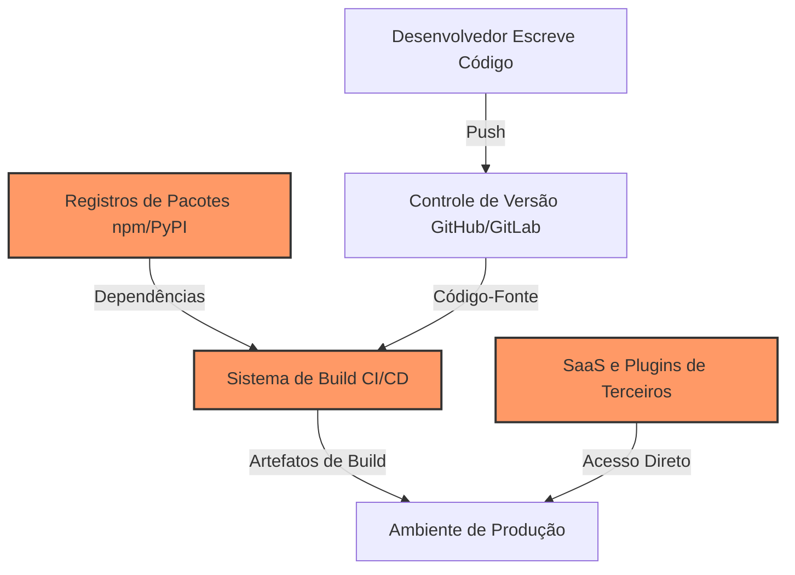

# Segurança Avançada da Cadeia de Suprimentos

A cibersegurança tradicional concentra-se fortemente na defesa de perímetro, firewalls de rede e segurança direta de endpoints. No entanto, à medida que as organizações fortalecem sua infraestrutura voltada para o exterior, os atacantes mudaram o foco para uma porta dos fundos altamente eficaz: a **Cadeia de Suprimentos de Software** (Software Supply Chain).

Um ataque à cadeia de suprimentos não compromete o alvo diretamente. Em vez disso, ele injeta código ou comportamento malicioso em um componente, pacote, ferramenta de desenvolvedor ou integração de nuvem de terceiros confiável que o alvo já utiliza. Como o alvo confia na origem, a atualização maliciosa é importada automaticamente, passando direto pelas defesas de perímetro.



---

## 1. Vetor de Origem a Montante (Upstream): Confiança em Mantenedores

O primeiro ponto de entrada ocorre logo no início da cadeia de suprimentos: nos repositórios de código-fonte de projetos e bibliotecas de código aberto.

### Engenharia Social contra Mantenedores
Os atacantes visam os mantenedores de projetos de código aberto por meio de campanhas complexas de engenharia social planejadas ao longo de vários anos.
- **O Padrão de Ataque**: Um atacante cria diversas contas falsas (sockpuppets) para enviar pull requests úteis e legítimos a uma biblioteca de código aberto por meses ou anos. Assim que ganha a confiança do autor principal, ele se voluntaria para ajudar a manter o projeto. Após obter acesso direto de gravação e commit, ele insere silenciosamente um backdoor altamente complexo.
- **Caso Real de Estudo (XZ Utils, 2024)**: Um ator pseudônimo chamado "Jia Tan" passou mais de dois anos contribuindo para a biblioteca de compressão `xz`. Eventualmente, ele obteve o status de mantenedor e injetou um backdoor extremamente furtivo na biblioteca `liblzma`, projetado para permitir execução remota de código via SSH. O backdoor foi detectado por um desenvolvedor que notou lentidões microscópicas na CPU durante conexões de banco de dados.

### Explorações de Dependências e Registros de Pacotes
Os registros de pacotes (como npm, PyPI e RubyGems) lidam com bilhões de downloads automatizados diariamente. Os atacantes exploram a forma como os gerenciadores de pacotes resolvem nomes e executam scripts de instalação:

- **Typosquatting**: Atacantes registram pacotes com nomes extremamente parecidos aos de bibliotecas populares (por exemplo, `reqeusts` em vez de `requests`). Se um desenvolvedor comete um erro de digitação ao configurar suas dependências, ele acaba baixando o pacote malicioso.
- **Confusão de Dependência (Dependency Confusion)**: Organizações geralmente usam pacotes internos privados (por exemplo, `@minhaempresa/autenticacao`). Se o registro interno de pacotes estiver mal configurado ou falhar, o gerenciador de pacotes pode buscar em registros públicos. Os atacantes registram o mesmo nome do pacote privado (`@minhaempresa/autenticacao`) em registros públicos com um número de versão extremamente alto (como `99.9.9`), forçando o pipeline de build a baixar o pacote público do atacante em vez do pacote privado legítimo.
- **Scripts de Instalação Maliciosos**: O arquivo `package.json` no ecossistema JavaScript ou scripts de configuração em Python permitem que desenvolvedores executem comandos automáticos durante a instalação de pacotes (usando ganchos como `preinstall`). Os atacantes publicam pacotes que usam esses ganchos para rodar scripts que coletam e roubam variáveis de ambiente, chaves SSH e tokens de nuvem no exato momento em que o comando `npm install` ou `pip install` é executado.

---

## 2. Vetor de Build e CI/CD: Comprometendo o Pipeline

Mesmo que o seu código-fonte esteja seguro, o ambiente que compila, empacota e distribui o seu código pode ser comprometido.

### O Pipeline de CI/CD como Motor de Ataque
Os runners de Integração Contínua e Entrega Contínua (CI/CD) são alvos de alto valor porque possuem acesso direto de leitura aos seus repositórios privados, permissões de gravação em registros de pacotes e chaves administrativas para ambientes de nuvem.

- **SUNBURST (SolarWinds Orion, 2020)**: Este continua sendo um dos ataques à cadeia de suprimentos mais sofisticados da história. Os atacantes comprometeram o ambiente de build interno da SolarWinds. Eles implantaram um processo malicioso em segundo plano que monitorava a execução do compilador. No exato instante em que o compilador começava a montar a atualização legítima do Orion, o malware substituía um arquivo de código-fonte na memória por uma versão trojanizada. A atualização de software resultante, assinada oficialmente pela empresa, continha um backdoor distribuído a 18.000 clientes.
- **Roubo de Token OIDC e Envenenamento de Cache do Actions**: Nos pipelines modernos do GitHub Actions, os fluxos de trabalho usam o OpenID Connect (OIDC) para solicitar tokens temporários de curta duração dos provedores de nuvem (como AWS ou npm). Atacantes enviam pull requests a partir de forks explorando configurações de workflow (como `pull_request_target`) para sobrescrever caches compartilhados do runner. Na próxima execução de um build legítimo, o runner carrega o cache envenenado, executa o código malicioso, extrai os tokens de publicação OIDC diretamente da memória do runner e publica atualizações não autorizadas.

---

## 3. Vetor do Ambiente do Desenvolvedor: Comprometendo a Estação de Trabalho

O laptop de um desenvolvedor é a porta de entrada definitiva para a cadeia de suprimentos. Como os desenvolvedores possuem chaves de gravação para repositórios críticos, consoles de nuvem e portais de publicação, suas configurações locais são alvos constantes.

### Extensões de IDE Maliciosas
Os ambientes de desenvolvimento integrados (IDEs) modernos, como o VS Code, dependem de marketplaces de extensões de terceiros para fornecer autocompletar, linters e temas visuais.
- **Sequestro de Extensões**: Os atacantes compram extensões antigas e populares de desenvolvedores legítimos ou adquirem domínios associados a extensões abandonadas. Eles lançam atualizações contendo payloads maliciosos que rodam localmente dentro do editor do desenvolvedor, extraindo tokens de sessão ativos, histórico do navegador e chaves SSH.

### Sequestro de Espaços de Trabalho (Workspaces)
Atacantes usam arquivos de configuração do repositório para forçar a execução de códigos assim que um desenvolvedor clona um projeto e o abre em seu editor:
- **Tarefas do VS Code (`tasks.json`)**: Abrir uma pasta no VS Code permite que o projeto execute tarefas locais. Os atacantes enviam uma tarefa maliciosa para um repositório público que é disparada automaticamente no evento de abertura da pasta (como `folderOpen`), rodando scripts maliciosos no terminal local do desenvolvedor sem o seu consentimento ativo.

---

## 4. Defesas Arquiteturais e Mitigação

Proteger a cadeia de suprimentos exige uma abordagem de **Zero Trust** para dependências e ferramentas de terceiros. Trate cada pacote importado e ação automatizada como não confiável até que seja validado.

```
       Vulnerabilidade                    Estratégia de Defesa
┌───────────────────────────┐      ┌───────────────────────────┐
│ Typosquatting / Confusão  │ ───> │ Lockfiles + Escopos Privados│
├───────────────────────────┤      ├───────────────────────────┤
│ Dependências Vulneráveis  │ ───> │ Análise SCA + SBOMs       │
├───────────────────────────┤      ├───────────────────────────┤
│ GitHub Actions Vulnerável │ ───> │ Fixar por Hash de Commit  │
├───────────────────────────┤      ├───────────────────────────┤
│ Exfiltração de Segredos   │ ───> │ OIDC Restrito + Scanners  │
└───────────────────────────┘      └───────────────────────────┘
```

### Endurecimento de Dependências
- **Fixação Rígida de Pacotes**: Use arquivos de bloqueio (lockfiles como `package-lock.json`, `pnpm-lock.yaml`, `poetry.lock`) para garantir compilações reproduzíveis. Nunca use versões abertas (como `*` ou `^latest`) em produção.
- **Escopos e Registros Privados**: Utilize escopos de pacotes (ex.: `@minhaempresa/`) e configure seu gerenciador para buscar bibliotecas escopadas exclusivamente do seu registro privado, eliminando riscos de confusão de dependências.
- **Desativar Scripts de Instalação**: Configure seus gerenciadores de pacotes para ignorar scripts durante a instalação (ex.: executando `npm install --ignore-scripts` ou definindo `ignore-scripts=true` no arquivo `.npmrc`).

### Arquitetura de Segurança no CI/CD
- **Fixe as Actions por Hash de Commit**: Não utilize tags mutáveis (como `uses: actions/checkout@v4`). As tags podem ser alteradas por atacantes para apontar para códigos maliciosos. Fixe suas importações usando hashes criptográficos SHA completos (como `uses: actions/checkout@b4ffde65f46336ab88eb53be808477a3936bae11`).
- **Workflows com Menores Privilégios**: Force permissões estritas nos seus arquivos de workflow por padrão. Bloqueie acessos de escrita e geração de tokens OIDC a menos que explicitamente exigido por um job de publicação específico:
  ```yaml
  permissions:
    contents: read
    id-token: none
  ```
- **Análise Estática de Workflows**: Adicione scanners de segurança (como o **zizmor**) nas suas esteiras de CI. Essas ferramentas analisam as configurações dos workflows, alertando imediatamente sobre falhas de segurança estruturais, como tokens com privilégios excessivos ou checkouts perigosos.

### Transparência e Atestado
- **Gere SBOMs (Software Bill of Materials)**: Um SBOM é um inventário completo e legível por máquina contendo cada componente, dependência e licença em uso no seu software. Ferramentas como o `syft` escaneiam seu código-fonte e compilações para gerar um relatório abrangente, facilitando o rastreamento de componentes vulneráveis.
- **Atestados de Build**: Gere atestados criptográficos das suas compilações (utilizando tecnologias como o Sigstore e o GitHub Artifact Attestations). Eles provam que um contêiner ou pacote específico foi construído dentro de um fluxo de trabalho seguro e específico do GitHub Actions, garantindo que nenhum binário adulterado possa ser implantado.

---

## Principais Conclusões

1. **Suas dependências são o seu próprio código**: Você é totalmente responsável pela segurança de cada biblioteca, utilitário e ferramenta de build que importa para o seu projeto.
2. **Não confie em nada implicitamente**: O fato de um pacote possuir assinatura digital ou vir de uma esteira legítima de build não prova que ele é seguro; a própria conta que assina o pacote pode ter sido comprometida.
3. **Isole as fronteiras do seu CI/CD**: Aplique os princípios do Zero Trust em seus ambientes de build. Bloqueie segredos em pull requests não confiáveis originados de forks e limite as permissões de token por padrão.
4. **Proteja seu ambiente de desenvolvimento**: Trate sua máquina local como um ativo de produção. Mantenha as ferramentas atualizadas, audite extensões de editores e revise arquivos de configuração de workspaces antes de abrir projetos de origem desconhecida.
